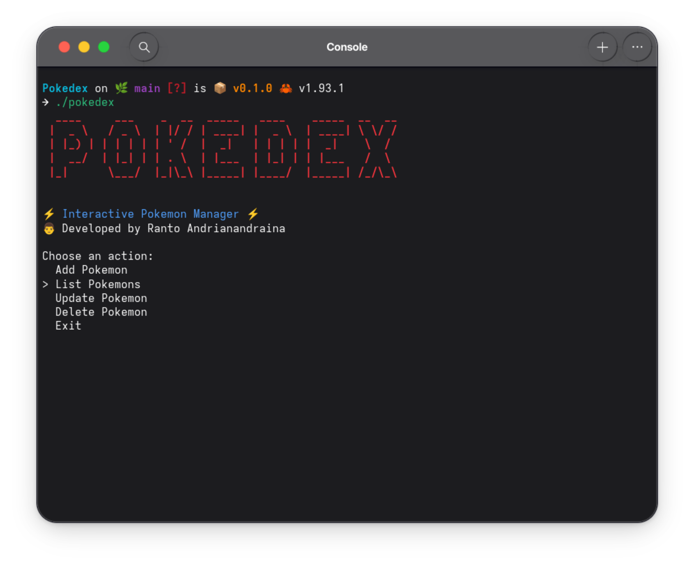

# Pokedex 🦀

    

        An interactive Pokémon manager built in <b>Rust</b>, designed to provide a modern and professional terminal experience.
    

     
    

        Pokedex CLI allows you to create, manage and organize your Pokémon collection using an interactive menu system and a beautifully formatted table display.
    

## Features

- **Interactive Menu** — Navigate with arrow keys
- **Add Pokémon** — Insert a new Pokémon interactively
- **Modern Table View** — Display Pokémon in a clean formatted table
- **Update Pokémon** — Modify existing Pokémon data
- **Delete Pokémon** — Remove Pokémon safely
- **JSON Storage** — Persistent local database
